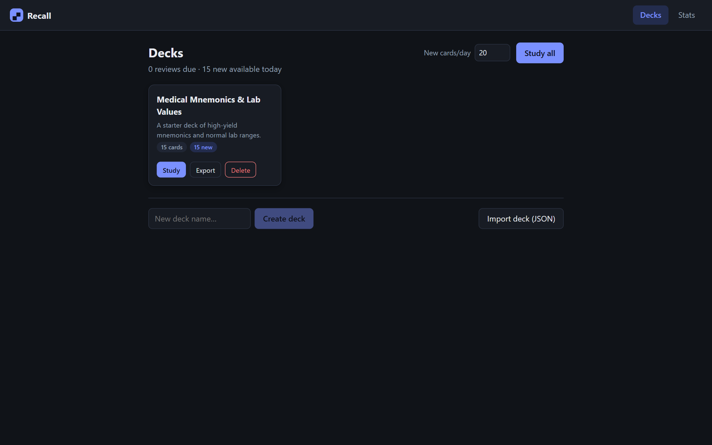

# Recall — Spaced Repetition Flashcards

A fast, local-first flashcard app built around the **SM-2 spaced repetition algorithm** (the scheduler family behind Anki). Designed for med students and anyone else who has to move a mountain of facts into long-term memory: study only what is about to slip, right before it slips.

Everything runs in the browser and persists to `localStorage` — no account, no server, no tracking. A seeded demo deck of medical mnemonics and lab values is included so the app is usable the moment it loads.

## Features

- **Decks and cards** — full CRUD for decks and cards (front/back, optional tags), with inline editing and markdown-lite formatting on cards (`**bold**`, `*italic*`, `` `code` ``).
- **SM-2 study sessions** — flip to reveal, grade with Again / Hard / Good / Easy (mapped onto SM-2's 0–5 quality scale). Each button previews the interval you'll get. Failed cards cycle back into the current session.
- **Due queue** — review cards surface when due; new cards are introduced under a configurable daily limit (default 20). Study a single deck or everything at once.
- **Stats dashboard** — cards due today, total / new / learning / mature counts, a 30-day reviews chart, and 30-day retention (correct grades ÷ total grades).
- **Import / export** — decks round-trip as JSON, including scheduling state, so exports double as backups.
- **Keyboard-first studying** — `Space` to flip, `1`–`4` to grade, `Esc` to exit.
- **Light & dark** — follows your OS via `prefers-color-scheme`.

## How the scheduling works (SM-2 in brief)

Every card carries three scheduling values: an **ease factor** (how easy the card is, starts at 2.5, floored at 1.3), an **interval** (days until the next review), and a **repetition count**.

- **Successful reviews** (quality ≥ 3) walk the interval up: 1 day → 6 days → previous interval × ease. A well-known card is quickly reviewed only every few months.
- **Every grade adjusts ease**: Easy (+0.10) grows future intervals faster; Hard (−0.14) and failures (up to −0.80) slow them down. Ease never drops below 1.3, so intervals always grow at least 1.3× — no card can get stuck shrinking forever.
- **Lapses** (quality < 3) reset the repetition count and send the card back to a 1-day interval, "as if memorized anew", while the lowered ease makes the relearned card climb more cautiously.

The scheduler lives in [`src/lib/sm2.ts`](src/lib/sm2.ts) as a pure, documented module with no dependencies on the UI or storage layers, and is covered by unit tests.

## Tech stack

- **React 18** + **TypeScript**, bundled with **Vite**
- **Vitest** for unit tests
- `localStorage` for persistence — no backend, no other runtime dependencies

## Getting started

```bash
npm install
npm run dev      # start the dev server (Vite prints the local URL)
```

Production build:

```bash
npm run build    # type-checks, then bundles to dist/
npm run preview  # serve the production build locally
```

## Tests

```bash
npm test         # run the vitest suite once
npm run test:watch
```

The suite covers the SM-2 core: interval progression (1 → 6 → ×ease), ease-factor adjustments and the 1.3 floor, lapse handling, grade mapping, and input validation.

## Project structure

```
src/
  lib/
    sm2.ts        # pure SM-2 scheduler (documented, unit-tested)
    sm2.test.ts   # vitest suite for the scheduler
    queue.ts      # due queue + daily new-card limit
    stats.ts      # stage counts, 30-day chart data, retention
    storage.ts    # localStorage persistence
    transfer.ts   # JSON import/export
    seed.ts       # demo deck (medical mnemonics & lab values)
    markdown.ts   # markdown-lite renderer (escaped, injection-safe)
  components/     # DeckList, DeckView, StudySession, StatsDashboard
```

## Screenshots




